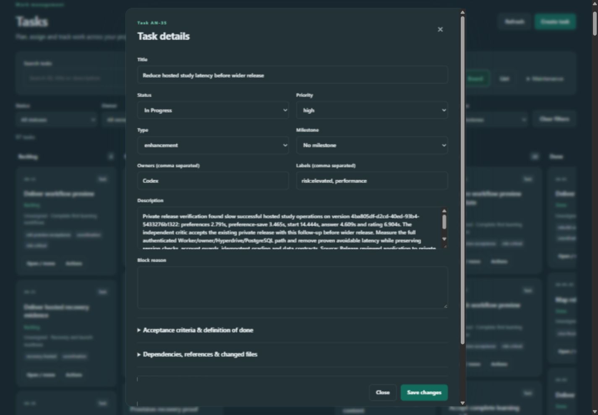
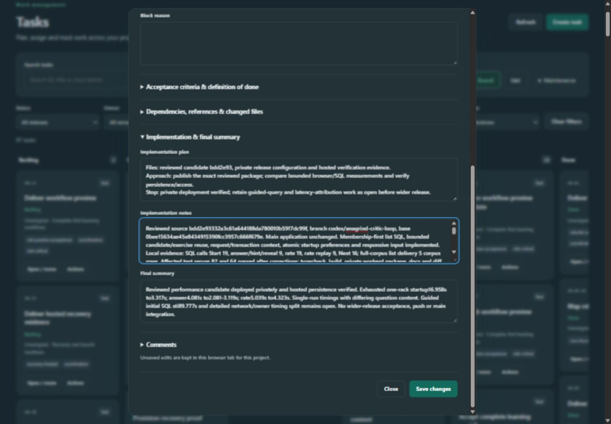
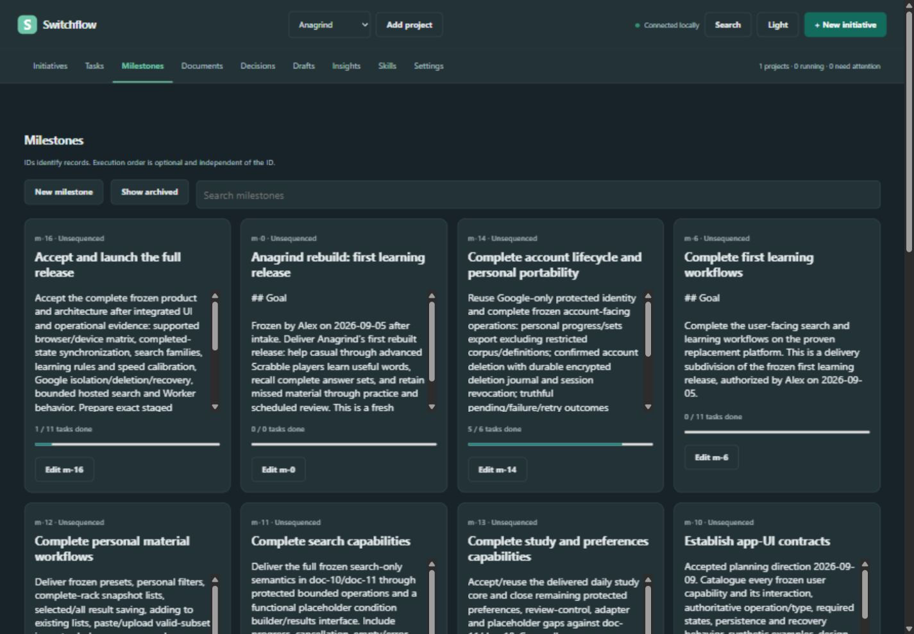
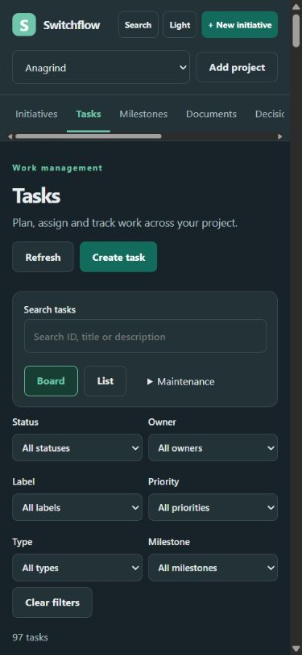

# Switchflow UI review: make the next human action clear

**22 September 2026 · Current UI baseline: `763297bf791771a9a3d2633630960b625f290d73`**

**Recommended next step:** the Switchflow product/design owner should adopt a shared interaction contract for navigation, next-action selection, task reading and history, then validate a rendered redesign using the existing long records. Start with the sidebar and readable task details, while resolving the meaning of “Needs you” before adding any automatic “Next” recommendation. The roadmap below separates small repairs from the larger interaction redesign.

The principal problem is that Switchflow makes records available but asks the human to reconstruct their importance. It gives substantial space to metadata, repeated explanatory text and history, while the current decision, task narrative and path back to the previous context receive less support. Moving the top navigation into a sidebar is appropriate, but the largest improvement will come from making the everyday sequence coherent: **orient → choose → read → act → return**.

This report contains **33 consolidated findings**, five product comparisons, two follow-up public-code investigations, 13 current Switchflow screenshots, an action inventory, proposed layout/scroll rules, and an improvement path with testable outcomes. The code follow-up adds two drag/drop findings and sharpens existing recommendations for conditional content, context retention, loading and recovery.

## Contents

1. [Your four concerns](#1-your-four-concerns)
2. [Evidence and limits](#2-evidence-and-limits)
3. [Real comparison workflows](#3-real-comparison-workflows)
4. [Findings and reasons for change](#4-findings-and-reasons-for-change)
5. [Proposed human interaction model](#5-proposed-human-interaction-model)
6. [Spacing, typography and scrolling contract](#6-spacing-typography-and-scrolling-contract)
7. [Everyday actions and exceptional states](#7-everyday-actions-and-exceptional-states)
8. [Improvement path](#8-improvement-path)
9. [Human acceptance scenarios](#9-human-acceptance-scenarios)
10. [Evidence index and remaining verification](#10-evidence-index-and-remaining-verification)

## 1. Your four concerns

| Concern | Review conclusion | Recommended improvement | Why it matters |
| --- | --- | --- | --- |
| Topbar should become sidebar | **Agree.** Nine destinations occupy a second horizontal band and scroll sideways on narrow screens. | Persistent, collapsible desktop sidebar; mobile navigation drawer; small contextual page header. | Stable places are easier to recognize and return to; content gets more vertical space. |
| Next milestone/task is unclear | **Confirmed.** All 17 live milestones were Unsequenced; alphabetical order put the final launch milestone first. The overview said 0 need attention while five Ready tasks belonged to Human. | Separate **Needs you**, **Agent working**, **Next eligible**, and **Waiting**. Show the reason and evidence for each recommendation. | A status, sort order or completion percentage does not tell a person what they should do next. |
| Task text boxes do not show their contents well | **Confirmed and measured.** A real 3,404-character notes field had only 100px of visible height for 705px of content. | Readable task detail by default, explicit edit mode, adaptive narrative editor and full-page expansion. | Opening a task is usually an act of reading and understanding before editing. |
| Too much full-history scrolling | **Confirmed as an inconsistent policy, with an additional completeness problem.** Comments/runs/Done history expand, while initiative events silently stop at 25. Some other elements already scroll internally. | Summaries first; filtered, bounded histories with older-record access; one primary reading scroll per detail. | The human needs current context quickly and complete evidence when investigating. Neither endless expansion nor silent truncation provides both. |

### What the current screens demonstrate

**Desktop task detail:** metadata occupies the top of an edit form, followed by a 100px description and an equally large empty Block reason field. The sticky action footer is a useful existing behavior to preserve.

**Long notes:** the implementation notes field exposes approximately 14% of its scroll height at once. That ratio describes geometry, not measured comprehension. Manual resizing is available, but the default makes every reader repair the layout.

**Milestones:** the first visible outcome is the final launch, because every milestone lacks explicit sequence and the fallback is alphabetical. Tiny independent description scrollers and literal Markdown headings make the cards hard to scan.

**Narrow layout:** at 390 × 844, the Tasks screen contains navigation, search and filters but no visible task card. In the task dialog, metadata similarly consumes the first screen before the description becomes readable.

## 2. Evidence and limits

This combines the original four delegated investigations and rendered walkthrough with two follow-up agents tracing Plane and Backlog.md's public UI code. The follow-up examines gestures, state transitions and conditional rendering that static screenshots cannot establish.

| Evidence class | What was checked | What it supports |
| --- | --- | --- |
| **R — Rendered** | Existing local Switchflow service, Anagrind selected; 97 tasks, 17 milestones, documents, decisions, drafts, insights, settings, skills, search and the initiative creation form. Desktop 1440 × 1000, narrow 390 × 844, and the initial app-panel viewport. | Current visible layout, record counts, modal sizing, search results, navigation and close/refresh behavior. [Walkthrough register](rendered-observations.md). |
| **S — Source** | All 21 public UI files. Their served content matches the reviewed checkout after line-ending normalization. | Conditional states and interaction paths, including populated initiative gates, conflict handling and history limits. [Source audit](local-ui-audit.md), [match manifest](live-source-comparison.json). |
| **D — Documented comparison** | Current official Asana, Jira, Trello and Plane help documentation and product illustrations; official Backlog.md release/docs/source. | Real supported human workflows and available interface patterns. Does not mean a logged-in account was operated. |
| **C — Comparator code** | Plane and Backlog.md public UI implementations at the immutable revisions recorded in the two code appendices; handlers, callers, state and render predicates traced. | Implementation-specific interaction evidence, including drag/drop, conditional content and grouped loading. Not proof of a current hosted edition, successful browser operation or accessibility conformance. |
| **P — Proposal** | Consolidated layouts, sizes, sorting rules, batch sizes and acceptance targets below. | Design hypotheses and implementation direction. They are not claimed to be universal industry requirements or measured improvements. |

The live project has no initiatives. Populated Intake, Planning, UAT, active-run/recovery and long initiative histories were therefore source-reviewed, not exercised live. No project records, approvals, settings or production agent runs were changed. Competitor evidence is official documentation/source, not hands-on tenant testing. No participant study, full assistive-technology audit or performance benchmark was performed. The follow-up's Switchflow drag-visibility probe invokes the actual handler with DOM/API doubles; it is explicitly not a real browser gesture test.

“Industry standard” is used here carefully. **Common product conventions** include sidebars, personal queues, contextual detail panes, rich narrative reading and filtered activity. **Accessibility requirements** provide more precise rules for focus, reflow and targets. Exact widths, colors, padding and pagination sizes remain Switchflow design decisions to validate.

## 3. Real comparison workflows

These are sequences a person actually follows according to the products' primary sources. Each comparison identifies the useful interaction, its relevance and what should not be inferred.

| Product | Concrete human workflow | What Switchflow should learn | Evidence / limits |
| --- | --- | --- | --- |
| **Asana** | Sidebar → My tasks → filter/group an incomplete personal queue → select task → read details alongside work → expand full screen if needed → inspect comments/previous updates → return to queue. | Give attention its own destination; preserve the source list while reading; distinguish current description from prior updates. | [Navigation](https://help.asana.com/s/article/navigating-asana), [My tasks](https://help.asana.com/s/article/maximize-productivity-with-my-tasks), [task fields](https://help.asana.com/s/article/task-fields), [comments/history](https://help.asana.com/s/article/task-comments-and-attachments). Earlier updates can be collapsed; this does not establish page-numbered history. |
| **Jira** | Sidebar → board/backlog/list → quick filter → choose density/fields → open preview or detail → read main narrative with contextual properties → choose Comments or History → return to the filtered workset. | Let people reduce the workset before scrolling; use aligned lists and configurable density; separate narrative from categorization; filter the activity question. | [Navigation](https://support.atlassian.com/jira-software-cloud/docs/what-is-the-new-navigation-in-jira/), [board/backlog controls](https://support.atlassian.com/jira-software-cloud/docs/customize-your-view-of-the-board-and-backlog/), [list preview](https://support.atlassian.com/jira-software-cloud/docs/create-and-edit-work-items-from-your-list/), [activity types](https://support.atlassian.com/jira-software-cloud/docs/what-are-the-different-types-of-activity-on-an-issue/). No claim of item-history pagination; advanced dependency planning may be plan-dependent. |
| **Trello** | Open board switcher → search/recent/starred board → optionally pin switcher as sidebar → filter cards → open card → format description → return to board; personal Home provides a bounded Up Next route. | Keep global navigation separate from board actions; provide a bounded attention queue; support simple, contextual capture and clear return. | [Navigation](https://support.atlassian.com/trello/docs/navigation-in-trello/), [Home](https://support.atlassian.com/trello/docs/the-home-page/), [formatting](https://support.atlassian.com/trello/docs/how-to-format-your-text-in-trello/). Home documents up to 20 due-date cards. This is triage, not proof of history pagination or authoritative task sequencing. |
| **Plane** | Sidebar → Your Work or saved project View → filter → open side peek → choose modal/full screen for deeper work → collapse properties → inspect activity by tab/type/order → return to the source workset. | Adapt the reading surface to the task; retain context; put frequently reused questions into named views; make history explicitly selectable. | [Navigation](https://docs.plane.so/workspaces-and-users/customize-navigation), [Your Work](https://docs.plane.so/your-work), [detail and activity](https://docs.plane.so/core-concepts/issues/overview), [Views](https://docs.plane.so/core-concepts/views). Tabs/filtering/sorting are documented; internal history scrolling/pagination is not established. |
| **Backlog.md** | Local browser → sidebar quick search or filtered board → task detail → read/preview → edit large Markdown fields with metadata alongside → save and return with context retained. Current source also renders all comments. | Reuse familiar local-tool patterns: sidebar, readable detail, large narrative editors, dependency/readiness explanations and filter/scroll retention. | [Official v1.51.0 release](https://github.com/MrLesk/Backlog.md/releases/tag/v1.51.0), [task detail source](https://raw.githubusercontent.com/MrLesk/Backlog.md/main/src/web/components/TaskDetailsModal.tsx). Switchflow pins v1.50.1 plus its patch; current upstream behavior must not be attributed to that pinned runtime. Backlog.md is not a complete solution to history or Switchflow's approval workflow. |

The comparison supports a shared pattern: **a focused workset plus a contextual detail surface**. It does not justify copying an entire competitor, adding calendars/timelines without a user need, or treating Ready as permission for an agent to execute.

Detailed step-by-step evidence and primary URLs: [Asana/Jira](research-asana-jira.md), [Trello/Plane](research-trello-plane.md), [Backlog.md](research-backlog-md.md). Additional implementation evidence: [Plane code interactions](research-plane-code.md) and [Backlog.md code interactions](research-backlog-code.md). The code appendices supplement the original comparisons; their transfer suggestions are candidates, with the consolidated contract below taking precedence.

### What the code review adds beyond the screenshots

| Interaction invisible in a static screenshot | Source-backed comparison | Consequence for this report |
| --- | --- | --- |
| Reach an initially empty destination | Backlog.md defers revealing hidden columns until after native drag starts; Plane keeps configured visible columns as drop targets even when empty. | New F32. Hiding unused space must not remove the next interaction; reveal timing itself needs a real gesture test. |
| Place a card exactly where intended | Backlog.md handles upper/lower card halves, insertion markers and self-drop; Plane provides insertion guidance, drag-over feedback and board/column autoscroll. | New F33 plus stronger F13 acceptance. Verify gesture intent, final order and cancellation, not merely that a drag handler exists. |
| Understand absent or unavailable content | Plane conditions parent detail, editing and the activity composer on record/permission state. Backlog.md omits an empty Final Summary in preview but reveals it in Edit; Description/Plan/Notes instead retain “No …” placeholders, while unresolved parent/subtask sections are absent. | Refine F07/F31 with a field-specific presence/action matrix. Preserve discoverable creation paths where supported; missing required evidence remains explicit. |
| Reach more work inside a long column | Plane's inspected board requests initial grouped batches and subsequent group/subgroup pages; subgroup rendering includes a visible Load more path. | Strengthens F16/Stage 4 with actual code precedent for per-group loading. This does **not** establish activity-history pagination. Backlog.md's full task-list/comment rendering remains a counterexample. |
| Navigate while data changes | Backlog.md preserves source query state and rejects stale modal reads; Plane guards peek-close behavior around nested overlays and restores focus on its Escape path. | Sharpen F18/F20/F23/F31: test rapid A→B navigation, nested overlay Escape, dirty writing and exact focus return. Preserve existing Switchflow generation guards. |
| Recover after a partially understood move | Backlog.md exposes applied/partial/unknown mutation outcomes; selection paths explain affected records. | Refine F31: reconcile before retry and do not promise a naive undo over concurrent changes. Bulk selection is an optional future contract, not a new feature requirement. |

All rows are **C — comparator source**, with immutable file/line links and limitations in [Plane](research-plane-code.md) and [Backlog.md](research-backlog-code.md). The exact inspected versions are comparators, not a claim about every release, hosted tier or browser. Existing controls, accessibility gaps and partial error recovery in those implementations are reasons to borrow the useful behavior selectively.

## 4. Findings and reasons for change

**Priority:** P1 = core decision, reading or trust problem; P2 = material navigation/interaction friction; P3 = bounded consistency/polish. These are repair priorities, not a claim of a production incident. Source-only findings should be reproduced in disposable fixtures before changing behavior. References L01–L27 point to the detailed [source audit](local-ui-audit.md); R01–R15 to [rendered observations](rendered-observations.md). The consolidated recommendations in this report supersede the research agents' provisional prescriptions; the appendices retain their evidence and alternatives.

### Orientation, next work and milestones

| ID | Priority / evidence | Finding and human cost | Improvement and why | Acceptance example |
| --- | --- | --- | --- | --- |
| F01 | P1 · R01/R02, S L01 | “0 need attention” sits alongside five Ready Human tasks. The counter covers initiatives, but appears project-wide. | Count or explicitly separate pending initiative decisions and ready human tasks. A precise label prevents false reassurance. | The same dataset says “0 initiative decisions · 5 ready human tasks,” with a route to each. It does not claim every Ready task is approved to execute. |
| F02 | P1 · R02/R06, S L01 | No combined explanation of current, next and blocked work. IDs, card order, milestone sequence and readiness compete as possible signals. | Add distinct Needs you / Agent working / Next eligible / Waiting sections with reasons and origin links. This reduces inference and protects approval meaning. | A blocked earliest milestone cannot become “Next” solely because it sorts first; ambiguous order is labelled unresolved. |
| F03 | P2 · R01/R12, S L05 | Two horizontal navigation bands, offscreen destinations and repeated onboarding consume working space. | Sidebar with visible current project/destination, collapsible groups and narrow-screen drawer. Shorten returning-user intro. Asana/Jira/Plane and Backlog.md support the convention. | All destinations remain discoverable, keyboard focus returns after drawer close, current context stays visible while reading. |
| F04 | P1 · R06, S L01 | Every live milestone is Unsequenced, so “Accept and launch” appears first. The prose explains IDs, but offers no recovery from missing sequence. | Separate ordered upcoming work, active work, completed outcomes and unsequenced records. Offer “Review milestone order” only as a planning action. | Show “Order not established” rather than inventing the next milestone; editing display order does not silently change authorization. |
| F05 | P2 · R06, S milestones.css:5 | Tall cards mix raw Markdown, independent description scrollbars and 0/0 progress for contract records. Users must inspect many boxes to understand one outcome. | Show title, one short summary, meaningful state, task counts and blocker/next cue; put full formatted scope in detail. Give 0-task records a truthful “No delivery tasks linked” state. | Milestone cards scan without inner prose scrolling; 0/0 is not presented as failure or acceptance. |
| F06 | P2 · R07, S L06 | Edit opens after the entire milestone grid, then close targets the first item. Reading a milestone feels like being transported elsewhere. | Use consistent detail navigation and restore the exact origin. Offer “Open milestone” separately from edit. | Open a middle milestone, inspect a linked task and return to the same card/filter/position. |

### Task reading, editing and manipulation

| ID | Priority / evidence | Finding and human cost | Improvement and why | Acceptance example |
| --- | --- | --- | --- | --- |
| F07 | P1 · R03/R04/R14, S L02 | Every prose field starts at four rows / 100px, even 3,404-character notes. Metadata comes first; reading requires field scrolling and resizing. | Read view by default; narrative as the main area, compact secondary properties; explicit edit/expand. Asana/Plane/Jira and Backlog.md all offer useful contextual detail patterns. | Long formatted description/notes are readable with one primary content scroll; a 1-line blocker is compact; narrow layout shows task purpose before metadata. |
| F08 | P2 · R02/R14, S L21 | Small critical metadata and repeated Open / move controls use card space without clarifying the primary action. Title becomes a clipping input in detail. | Use a wrapping task title as the heading, readable status/owner, one clear open target and a contextual menu. Place Move in that menu with an explicit destination. | Users can name task, owner and status without opening it or deciphering small labels; title is fully readable. |
| F09 | P2 · S L11 | Dependency entry is comma-separated IDs; reserved “dependent” may reach task cards without useful explanation. | Linked titles, predecessor states, “Blocked by / Blocks,” and a searchable relationship picker. This turns relationship data into a human explanation. | User identifies the actual prerequisite and navigates to it without remembering an ID. |
| F10 | P2 · S L12 | AC needs `[x]` syntax; DoD has adjacent Keep and completion checkboxes. Clearing the wrong control can remove rather than complete a criterion. | Consistent checklist rows: complete, edit, remove; advanced bulk text mode optional. | Checking a criterion never removes it; removal names the criterion and is reversible before save. |
| F11 | P2 · S L16 | Ordinary Close silently keeps task edits; there is no ordinary discard path. Draft policy sits below the form. | Visible saved/unsaved/draft state and consistent Save / Discard / Close meaning. Keep recovery but explain what survives. | Edit → close → reopen → discard → reopen restores the saved value without developer tools. |
| F12 | P1 · S L15/L26 | Conflict comparison uses raw JSON; discarding a document draft has no undo. Recovery asks the user to understand storage structure or risks losing prose. | Human field-level comparison and reversible discard. Keep revision checks intact. | A description/labels conflict is understandable without JSON; accidental discard of a long draft can be recovered. |
| F13 | P2 · S L18 | Within-column task ordering is drag-only. Open / move does not provide equivalent position control. | Move menu with before/after/top/bottom choices and clear feedback; distinguish visual order from approved work order. | Keyboard and touch users can perform the same placement as a pointer drag. |

### Reading history, finding work and retaining context

| ID | Priority / evidence | Finding and human cost | Improvement and why | Acceptance example |
| --- | --- | --- | --- | --- |
| F14 | P1 · S L03 | All comments precede their composer; all initiative runs render into detail. History pushes contribution and current actions away. | Recent meaningful update, discussion/activity filters, collapsed run summaries, accessible older-record loading. Keep the composer readily reachable. | 100 comments/50 runs do not make the initial task view longer; all earlier records remain reachable. |
| F15 | P1 · S L04 | Initiative activity silently shows only the latest 25 events. This can look like a complete history. | Loaded/total or truthful “latest” label plus older-event access. | In a 26-event fixture, event 1 remains retrievable and the limit is apparent. |
| F16 | P2 · R02/R09, S L20 | Long task columns and 63 Done history rows expand the page. The largest column controls the board's vertical burden. | Persistent column headings, bounded board lanes; explicit paging/load-more for lists and audit tables. | Long Done column does not push controls out of reach; current/total ranges are visible. |
| F17 | P2 · R13, S L09 | Searching one task still says 97 tasks; empty board columns can hide that match offscreen. | “1 of 97 tasks,” active filter indicators and an obvious filtered-list route; collapse empty filtered groups when appropriate. | A one-result query produces a visible, truthful one-result state with Clear filters. |
| F18 | P2 · S L09/L10 | List reuses card content; sort choices and durable working-view state are absent. | Aligned comparison rows, a restrained sort/density control, per-project view retention. Jira/Plane illustrate this workset model. | Switching away/back preserves the workset; rows permit scanning status/owner/milestone down consistent columns. |
| F19 | P2 · R10, S L19 | Global search has a 40-result native request cap and one undifferentiated list, with no scope/type controls, matched excerpts or continuation. | Type filters, snippets, relevant status context and truthful cap/continuation wording. | Two similarly titled records are distinguishable; a capped result set does not claim completeness. |
| F20 | P2 · R05, S L07/L08 | Close leaves task selected in URL; reload reopens it. Linked tasks also lose initiative/milestone origin. | Route detail open/close consistently, with explicit origin breadcrumb and Back/Forward behavior. | Close→reload stays closed; linked task→Back returns to the exact plan/milestone position. |

### Human gates, accessibility and supporting surfaces

| ID | Priority / evidence | Finding and human cost | Improvement and why | Acceptance example |
| --- | --- | --- | --- | --- |
| F21 | P1 · S L13 | The current initiative action appears below request/context/scope/plan. Returning to a decision requires retraversing evidence. | Stable decision/action region plus Scope / Plan / Evidence navigation; keep consequence text beside approval. | Long-plan review can jump to evidence and return to the decision without losing the reading position. |
| F22 | P1 · S L14/L27 | UAT has no progress/resume overview. Source additionally shows per-check results/notes are submitted by Accept, while Request rework submits only overall feedback and then clears UAT drafts. Detailed failed observations can be lost from that path. | First reproduce the rework path in a disposable fixture; retain and submit the review's observations when requesting rework. Add completed/remaining counts and next-unchecked navigation. | Mark one check Needs rework with detailed notes, submit rework, reopen: those notes and their check association remain available to both user and correction workflow. No automatic acceptance. |
| F23 | P2 · S L17 | Task action/review dialogs have headings but no programmatically associated dialog name. | Name every dialog; deliberate entry focus, Escape and exact focus return. Follow the [WAI modal dialog pattern](https://www.w3.org/WAI/ARIA/apg/patterns/dialog-modal/). | Archive/promote/repair dialogs announce purpose and return to the initiating item after cancel. |
| F24 | P2 · R12/R14, S L05/L22 | Narrow layouts stack the entire navigation/filter/property hierarchy above work. Hidden connection status also removes useful context. | Drawer navigation, compact active-filter summary, primary narrative first, collapsed optional metadata and a compact connection state. | At 390px, the first task or task purpose is visible promptly; disconnection remains discoverable. |
| F25 | P2 · R08, S L22 | Documents already have a good reader, but narrow browse/TOC stacks and bottom-only edit actions can delay reading/saving. | Reuse its prose renderer for tasks; collapse Browse/Contents on small screens and keep identity/save state accessible. | Open a long document on narrow screen and reach content immediately; save remains easy during a long edit. |
| F26 | P2 · R09, S L23 | Insights shows raw milestone IDs and unlinked Done task rows. It describes totals without helping the user investigate them. | Outcome titles, links into filtered work and paged Done history; keep “Share marked Done” and “Last updated” wording honest. | A person opens the relevant completed task from Insights and returns to the same history position. |
| F27 | P2 · R15, S L16 | Drafts means saved backlog draft records, while task prose is also retained as an unsaved browser draft elsewhere. Same word, different recovery expectations. | Clearly label “Draft tasks” versus “Unsaved edits in this tab”; provide an explicit recovery route. | A user knows where an unfinished new task and an edited existing task can each be recovered. |
| F28 | P3 · S L24 | Add DoD default focuses the first existing row instead of the newly appended row. | Focus the new input explicitly. | With three items, Add places the cursor in item four. |
| F29 | P3 · R15, S L25 | Date display preferences are not consistently reflected in comments/activity/Insights. General Settings also includes native-browser-only fields. | Scope settings by effect; shared date formatting where promised, or accurate narrower wording. | The user can tell what a setting changes and sees the documented date format on affected surfaces. |
| F30 | P2 · R01/R02/R06, S L21 | Type sizes, padding, card height and control placement reflect individual components more than a common reading hierarchy. | Shared typography/spacing/action rules, tested with long titles and real prose; comfortable default and optional compact list. | Core state/owner/blocker remain readable while redundant controls and arbitrary gaps shrink. No claim of a contrast violation from font size alone. |
| F31 | P2 · S cross-cutting inventory | Loading/empty/offline/busy/conflict states exist, but action explanations and recovery placement vary by surface. Skills, native diagnostics and ordinary work also compete at one navigation level. | Shared state patterns and grouped navigation: explain what happened, whether drafts survive and the next available action; separate routine work from diagnostics. | Each disabled operation has a nearby reason; failure retains input; no-match offers clear filters; returning connection does not reset the reader's place. |

### Additional findings from the public-code follow-up

These extend the original 31 findings. They were discovered by contrasting competitor interaction code with Switchflow's handlers, not by inspecting another screenshot. [Probe source](probe-drag-visibility.mjs) and [recorded result](drag-visibility-probe.json) use disposable in-memory records and zero production writes.

| ID | Priority / evidence | Finding and human cost | Improvement and why | Acceptance example |
| --- | --- | --- | --- | --- |
| F32 | P2 · S + handler probe; C Backlog B01 | With `hideEmptyColumns`, Switchflow's render predicate allows empty columns while dragging, but `dragstart` only sets a variable. No redraw occurs; even an unchanged refresh skips rendering. The user cannot target an absent column. [Render predicate](../../template/.switchflow/scripts/control/public/tasks.js#L31), [handlers](../../template/.switchflow/scripts/control/public/tasks.js#L115). | Reveal eligible empty destinations safely after drag starts and restore the compact board after drop/cancel. Backlog.md explicitly defers its reveal to avoid aborting native Chromium dragging. Preserve the lifted node; a synchronous wholesale board rebuild is not an adequate fix. | Hide an empty Done column, begin a drag, reach the revealed destination, then cancel/drop. Verify pointer behavior, compact-state restoration and the non-drag Move alternative in a disposable browser fixture. |
| F33 | P2 · S + handler probe; C Backlog B02 | Drop placement is always before the hovered card, with no before/after marker. Dropping onto the lifted card removes its ID before lookup, fails to find the target, then appends it to the end. A two-card handler fixture requests reversing their order. [Drop calculation](../../template/.switchflow/scripts/control/public/tasks.js#L118). | Show the proposed insertion position, honor top/bottom intent and make unchanged/self-drops no-ops. Preserve the visible workset on success; announce the task and destination. Order must remain distinct from execution authority. | Drop above/below another card and onto the lifted card; the marker matches the saved outcome, and a self-drop sends no reorder. Repeat under filtering and across columns; keep all hidden tasks accounted for. |

These findings supplement F13's accessible alternative to dragging. They do not establish the behavior of actual pointer hit-testing, touch dragging or browser cancellation, which still needs a rendered fixture.

### What should be preserved

The redesign should retain the three explicit human gates; initiative next-action explanations; project-scoped draft recovery; explicit saves; failed-save retention; revision/conflict protections; keyboard focus styling; skip links; native dialogs; reduced-motion handling; document/skill readers; local image/link boundaries; and the task/settings sticky action controls. The review does not justify replacing these working safeguards or introducing additional routine human gates.

## 5. Proposed human interaction model

### A. Sidebar and page shell

Use a stable hierarchy rather than moving all nine topbar items into an equally weighted vertical list:

| Sidebar group | Destinations / contents | Reason |
| --- | --- | --- |
| Project identity | Current project picker, search, collapse control | Keep “where am I?” and “find something” in a consistent place. |
| Work | Overview, Needs you, Initiatives, Tasks, Milestones | Group daily decisions and delivery context. Needs you is a view over existing records, not a new gate. |
| Knowledge | Documents, Decisions | Preserve the distinction between instructions and recorded choices. |
| More | Draft tasks, Insights | Keep secondary work available without equal visual emphasis. Promote Draft tasks if usage warrants it. |
| Project tools | Skills, Framework health, Settings | Make maintenance findable while keeping it out of the primary decision path. |

Use a short contextual header for breadcrumb/title, local search/filter and the relevant creation action. Project-wide New initiative should remain easy to find, but a task page should make Create task its local primary action. On a small screen use a labelled menu button and drawer; do not squeeze an icon rail and a detail pane beside 390px content.

### B. Make next work explainable

The recommendation must be a truthful presentation of existing state, not a new implicit scheduling policy. Display these questions separately:

1. **What needs my decision?** Intake questions, scope/plan review, UAT, or a named recovery/access action. Show gate, affected initiative and the exact next interaction.
2. **What human-owned task is ready to inspect?** Include standalone/legacy tasks, which the current initiative attention count omits. Show their readiness and approval context separately.
3. **What is the agent doing?** Current task/phase, last meaningful update and whether it is running, queued, interrupted or waiting.
4. **What is eligible next under the approved plan?** Derive from accepted plan order and dependencies, and explain the reason. If several tasks can run in parallel, show an eligible group. If authority/order cannot be established, say so.
5. **What is waiting, and on whom?** Name the prerequisite, decision/access owner and condition that will unblock it.

Within a category, use authoritative plan order when available. When unrelated initiatives are simultaneously actionable, show the set with a transparent display sort or owner pin; do not pretend one is uniquely correct. Priority and dates can support sorting but must not manufacture execution permission. The live snapshot has 96 tasks without priority, so priority alone would not solve this project.

**Example based on the observed dataset, not an instruction to execute:**

> **Needs you:** 5 Ready human tasks. No initiative decisions pending.\
> **Task marked In Progress:** AN-35 · Reduce hosted study latency · assigned to Codex. Active execution is not established by this status.\
> **Milestone order:** Not established for 17 milestones. Review the approved plan before selecting the next outcome.\
> **Waiting:** 20 blocked tasks. Open a task to see its named prerequisites.

This is already more honest and useful than a single “0 need attention.” A production recommendation should reconcile current authority and stale records before claiming work can proceed.

### C. Task detail for reading, then editing

Open a task in a contextual side panel when enough width remains for the source list. Offer **Open full page** for long work. On narrow screens use the full-page/detail presentation directly. A separate third modal mode is optional; shipping all modes is not necessary to meet the need.

The detail should begin with a wrapping title and ID, status, owner, milestone/initiative breadcrumb, and current blocker/next-action explanation. Put formatted Description and acceptance criteria next. Use a properties rail or collapsed section for labels, type and infrequent fields. Separate **Overview**, **Discussion** and **Activity** where those are substantial. Summary and current guidance should precede implementation logs.

Edit one section or enter a deliberate full-edit mode. Preserve Markdown source, draft safety, validation and explicit saving. Keep save state and consequences visible. A compact block reason should not receive the same default height as a multi-page plan.

**Presence is an interaction state, not just a spacing choice.** Switchflow's current editor emits its optional narrative fields regardless of content ([source](../../template/.switchflow/scripts/control/public/tasks-editor.js#L13)). The read-first redesign should specify both what disappears and how the user can add it again. A blanket “hide empty sections” rule would remove useful creation paths or conceal missing evidence.

| State | Read presentation | Available action / reason |
| --- | --- | --- |
| Optional plan, notes or final summary absent | Omit the large empty content panel; keep a compact, named Add action for writable records | People can discover the field without scrolling through blank boxes. Editing still exposes it deliberately. |
| Existing narrative present | Render its formatted content, with edit/expand when allowed | Presence determines reading space; editing permission determines the affordance. |
| No blocker on an ordinary unblocked task | Omit an empty Block reason panel | Do not make absence look like unfinished mandatory data. |
| Task is Blocked but has no reason, or required approval evidence is missing | Show “Reason missing” / “Evidence missing” and a recovery action appropriate to authority | Missing required information is a meaningful state and must not be hidden. |
| No dependencies/subtasks | Keep a compact Add relationship/create-child route where supported; omit an empty graph/list | Empty related work should not occupy a full section or make relationship creation undiscoverable. |
| No discussion | Short empty state with a reachable composer for writable records | An empty conversation is a place to contribute, not a reason to remove the entry point. |
| Read-only or temporarily fenced | Keep saved content readable; show the reason beside unavailable editing actions | Absence, permission, loading failure and active-agent fencing are different states. |

Clearing a populated field must be a deliberate edit/save; a field omitted from a read view must never silently become an empty write. Existing revision and draft protections remain necessary.

**Human workflow after redesign:** Needs you → choose named task → read instructions and criteria → inspect linked prerequisite → return → record result/comment or edit a section → save → close to the same workset. Do not require repeated main-page navigation to perform that sequence.

### D. Histories that remain complete and manageable

Use three layers: current summary, recent meaningful events, full audit. Show Discussion separately from machine/run activity. Collapse a run into stage, outcome, time and next-action summary, with diagnostics available on demand.

For conversational history, start with a small recent batch and **Load older**. For an audit table, use page/range controls and filters. Use independent scrolling only for a sufficiently large, labelled auxiliary history panel or board column. Avoid a page, modal, section and textarea all scrolling within one another.

Do not silently discard old evidence from view. Display loaded/total when a trustworthy total exists; otherwise say “Latest 25” or “More available.” Loading older items should retain the visible anchor, focus and unsaved work. Search/filter should cover the intended complete history, not only the currently loaded batch.

The research supports progressive disclosure and filtering. The exact choice of batches versus pages is a Switchflow proposal, not a verified universal competitor behavior.

### E. Gestures, refresh and recovery

The code follow-up adds requirements underneath the visible layout:

- **Drag:** keep eligible destinations reachable, indicate exact insertion, support cancel/self-drop as no-ops, and provide the equivalent named Move action. Test edge scrolling with long columns. Do not turn a presentation reorder into approval or execution order (F13/F32/F33).
- **Context:** opening from search/Needs you should retain the source route and workset; closing should remove detail state without dropping filters. Ignore late reads for a previous task/project and retain readable content when a background refresh fails. Switchflow already has generation guards in its task loader; preserve and exercise them rather than claim they are missing (F18/F20/F31; [Backlog B06/B07](research-backlog-code.md)).
- **Conditional actions:** define empty, populated, unavailable and loading states together. When content can be created from the current surface, a hidden empty section needs a discoverable Add route; otherwise explain unavailability or provide a deliberate creation route where supported. A required missing field needs an explicit warning, not suppression (F07/F31).
- **Uncertain mutation outcomes:** distinguish a rejected operation from a write that succeeded but failed to refresh, or whose outcome is unknown. Reconcile current state before inviting retry. Backlog's archive/demotion paths provide a source-backed example; extending this presentation in Switchflow may need structured service results and must not guess from generic errors (F31; [Backlog B08](research-backlog-code.md)).
- **Future multiselect only:** expose count/target, make selection under filters explicit, exclude ineligible records and report partial outcomes. Do not add bulk workflow transitions solely because a comparator has them; Switchflow's authority model must govern their availability ([Backlog B03/B04](research-backlog-code.md)).

## 6. Spacing, typography and scrolling contract

These are **starting values for rendered testing**, not copied product specifications or legal requirements.

| Element | Proposed starting rule | Human rationale / verification |
| --- | --- | --- |
| Sidebar | Approximately 224–256px expanded; collapse when space is needed; drawer at narrow widths | Stable labels without starving task narrative. Validate long project names and keyboard access. |
| Main prose | 15–16px body, about 1.5–1.65 line height, roughly 60–85 characters per line | Make plans and instructions readable; full viewport width is not always a useful text width. Test real Markdown and zoom. |
| Metadata | Usually 12–14px; status, blocker and owner must stay readily readable | Current 10–11px metadata is overly subordinate to padding and repeated buttons. Size alone does not establish WCAG failure. |
| Spacing | Reusable 4/8/12/16/24/32px scale; close spacing within a field/group, larger gaps between distinct decisions | Help proximity explain relationships. Avoid uniform large gaps between every input. |
| Task narrative editor | Approximately 240–320px starting height for substantial prose; grow to a useful limit; explicit expand | Backlog.md provides a concrete 320px description/280px plan-notes precedent; final Switchflow values depend on viewport and content. |
| Short fields | Single-line control or modest auto-growth for short blocker text; hide empty optional read sections | Match the control to its information, rather than treating all strings equally. |
| Action regions | One clear primary action per decision; stable save/close region; destructive actions separated | Make consequence and recovery visible; avoid sticky controls obscuring focused content. |
| Card content | Title → state/owner → blocker/next cue → limited metadata; full scope in detail | Cards support choosing; detail supports understanding. |
| Targets | Aim for comfortable 36–44px routine controls where practical; verify actual accessibility minimums separately | [WCAG 2.2 target-size guidance](https://www.w3.org/WAI/WCAG22/Understanding/target-size-minimum.html) uses 24 × 24 CSS px with exceptions; 44px is not the universal AA minimum. |
| Focus and reflow | Visible, unobscured focus; meaningful narrow layout/zoom; non-drag alternatives | Use [focus-not-obscured guidance](https://www.w3.org/WAI/WCAG22/Understanding/focus-not-obscured-minimum.html), [reflow guidance](https://www.w3.org/WAI/WCAG22/Understanding/reflow.html) and the [dialog pattern](https://www.w3.org/WAI/ARIA/apg/patterns/dialog-modal/). Formal conformance remains to be tested. |

### Assign one scroll policy to each surface

| Surface | Recommended default | What should remain stable |
| --- | --- | --- |
| Overview | Short page: attention/current/upcoming summaries; drill into detail | Navigation and project identity |
| Kanban | Horizontal board when needed; viewport-bounded vertical columns with headings; list alternative | Column identity, filters, task counts |
| Task list | Compact rows; page or explicit load-more with range/total | Sort, filters, selected row, return position |
| Task detail | One primary narrative scroll; separate Activity view if large | Task identity, mode, save state and close/back |
| Milestone cards | No tiny prose scrollboxes; brief summary | Consistent card hierarchy |
| Milestone detail | One main scroll; bounded linked-task table where needed | Outcome identity, next-state explanation |
| Discussion | Recent batch with older loading; reachable composer | Selected task and visible event anchor |
| Runs/audit | Collapsed summaries; paged/filterable full history | Date/type filters and audit completeness cues |
| Documents/Skills | Primary prose scroll, navigation/TOC as useful secondary regions | Record identity and reading location |
| UAT | Current scenario or navigable bounded set with progress | Candidate, saved results, remaining count, finish action |

Avoid implementing pagination everywhere. A long document should remain naturally readable; a small conversation need not be split; a large audit table benefits from explicit page boundaries. The governing question is what the human is trying to retain in context.

## 7. Everyday actions and exceptional states

This action register ensures the redesign includes more than the four initial symptoms. The full file/line inventory appears in [local-ui-audit.md](local-ui-audit.md).

| Human action | Desired interaction contract | Findings / evidence |
| --- | --- | --- |
| Switch project / destination | Current context always visible; preserve per-project workset; guard unsaved writing | F03, F18, F20, F31 |
| Add project | Clearly distinguish selecting a local checkout from creating a product initiative; explain validation failure next to input | Source shell inventory; future rendered error-path check |
| Search globally / within view | Explain scope, counts and truncation; keyboard selection; return to results | F17–F19 |
| Create initiative / use dictation | Outcome-led prompt; explicit Start intake; text remains viable when dictation unavailable | R11: good existing baseline; dictation permission not exercised |
| Answer intake questions | Keep prior answers, show outstanding questions, make Submit consequence clear | F21, F31; source-only populated state |
| Approve scope / plan | Show exactly what is approved and what starts next; preserve evidence-reading context | F02, F21 |
| Follow delivery / cancel / retry | Distinguish running, queued, interrupted and blocked; latest meaningful update; clear consequence of cancel/retry | F02, F14/F15, F31 |
| Release recovery hold | Keep the explicit stopped-process confirmation; explain what check is required | Source recovery flow; no extra routine gate proposed |
| Read/update task / comment | Read-first, section edit, reachable composer, clear saved/draft status | F07–F12, F14 |
| Change status / order / assign | Explicit named destinations and search pickers; keyboard equivalent; reveal eligible hidden targets; exact insertion cue and self-drop no-op; status is not authorization | F09/F13, F18, F32/F33 |
| Check criteria | Consistent completion/edit/remove semantics | F10 |
| Create/edit milestone / assign tasks | Outcome detail near its origin; assignment search with counts; explain display sequence separately | F04–F06 |
| Archive/promote/cleanup/repair | Named review dialog, affected items/count, specific final action, cancellation returns to origin | F23; mutation paths source-reviewed only |
| Read/create/edit document or decision | Formatted reading, source/preview mode, safe navigation, understandable conflict, recoverable discard | F12, F25 |
| Resume drafts | Distinguish draft records from unsaved browser edits and their lifetime | F11/F27 |
| Inspect evidence / run UAT | Candidate and scenario visible; progress; notes retained; failed results travel into rework | F21/F22 |
| Add project update / request scope change | Clearly distinguish informational update from a change that returns to Intake; preserve consequence copy | Source initiative ancillary flow; F21/F31 |
| Inspect insights / past work | Explain totals; navigate to underlying work; use milestone titles; retain audit location | F16/F26 |
| Inspect skills / health / settings | Group as project tools; clarify read-only/native/workspace effects; save/discard state consistent | F28/F29/F31 |
| Recover from empty/no-match/loading/offline/conflict | Show state-specific explanation, retained input and exact recovery action | F12, F17, F31 |

Preserve action-specific safeguards. Consistency means familiar placement, feedback and language; it does not mean giving Approve plan, Save label and Delete record identical confirmation flows.

## 8. Improvement path

Effort bands describe scope, not time estimates. No implementation or migration is included in this review.

| Stage | Work and sequence | Owner / scope | Why now | Exit evidence |
| --- | --- | --- | --- | --- |
| **0. Agree the interaction rules** | Adopt sidebar groups; distinguish attention/readiness/authority; specify detail/return/draft/scroll semantics. Validate the next-work wording on the live dataset. | Product/design owner with workflow maintainer; small design package | Prevent a visual makeover from preserving misleading information or changing authorization. | Annotated screen flows and explicit ambiguous/parallel/blocked examples approved for prototyping. |
| **1. Repair clear interaction defects** | F01 attention label/count scope; F17 result count; F20 task close route; F23 dialog names; F28 new-row focus. Reproduce and repair F22 rework observation loss early. Add older-event completeness cue/access for F15. Reproduce F32/F33 with real pointer dragging before repairing target reveal and self-drop/placement. | UI maintainer; mostly small bounded repairs, F22/F15 may cross service boundary | Improves trust and recovery without requiring the whole redesign. | Focused functional checks and disposable-fixture walkthroughs; no lost notes, truthful counts, correct routes; drag markers/destinations agree with the saved order. |
| **2. Deliver shell and task reading** | Sidebar/mobile drawer; short overview; read-first task detail; prose sizing; conditional optional sections with Add paths; compact metadata; stable actions; exact origin return; preserve all existing draft and stale-response safeguards. | Product designer + UI implementer; medium cohesive change | Covers the most frequent orientation/read/act cycle and your immediate sidebar/modal concerns. | Desktop/narrow/zoom screenshots with empty and populated long tasks; keyboard walkthrough; user can read, add absent content and return without re-finding work. |
| **3. Explain next milestone/task** | Needs you queue, current agent work, approved next eligible group, blockers; milestone state/order recovery; dependency links. | Product/workflow maintainer + UI implementer; medium, semantically sensitive | A trustworthy recommendation depends on state meaning, not just layout. Requires Stage 0 and should reuse Stage 2 shell. | Fixture matrix for unsequenced, blocked, parallel, stale, standalone-human and authorized work; explicit reason on every recommendation. |
| **4. Bound history and scale** | Discussion/activity separation, older loading, run summaries, board/list/history boundaries, filter persistence and compact list. | UI implementer; medium, with API support only where needed | Mature records must remain navigable. First validate UI behavior; use server-side paging when volume justifies it. | 200 tasks, 100 comments, 50 runs, 150 completed rows; no missing evidence or lost scroll/focus/drafts. |
| **5. Finish authoring and consistency** | Checklists/pickers, field-level conflict compare, draft recovery, milestone detail, document mobile layout, dates/settings/insights links. | UI implementer with design review; medium | Removes repetitive friction across less frequent but consequential actions. | Full action/state matrix, both themes, keyboard and screen-reader checks, final human journeys. |

**Suggested first reviewable slice:** sidebar + task read/edit detail + corrected count/route behavior. Include the next-work contract in its design review, but do not fake a Next queue before authoritative selection is defined. Treat UAT note retention as a separate early defect investigation because it affects the reliability of a human review.

Keep these design changes separate from migration of existing task/milestone data. The report identifies missing order and legacy records; it does not authorize rewriting their sequence, approvals or status. Render ambiguity honestly while a deliberate planning action resolves it.

## 9. Human acceptance scenarios

These are proposed success criteria, not results already achieved. The suggested time targets should be calibrated with Alex and a small number of representative users; they are not competitor benchmarks.

| Scenario | Test dataset / interaction | Proposed pass condition |
| --- | --- | --- |
| Morning orientation | Five Ready Human tasks, zero initiatives, one active agent task, 20 blockers | Within roughly 10 seconds, user can distinguish their actions, agent work and unresolved sequence without opening multiple records. |
| Ambiguous next work | Earlier blocked milestone, later Ready task, two independent pending decisions, missing plan order | UI explains each category and ambiguity; never labels an unauthorized task simply “Next to run.” |
| Read a long task | 2,000-word description, formatted lists/code, 15 criteria, long notes | User scans instructions and criteria without manually resizing several fields; full-page expansion preserves work. |
| Return from evidence | Filtered list → initiative/milestone → task → linked document → back | Context, selection, filter and reading position remain recoverable in predictable steps. |
| Close and refresh | Task open → close → refresh; then direct deep link and Back/Forward | Route and visible state agree at every step. |
| Find older evidence | 100 comments, 50 runs, over 25 initiative events | Find a named prior decision without scanning everything; every old record is accessible; loading retains focus/anchor. |
| Complete/rework UAT | 20 checks, some passed, one failed with detailed notes, interruption/reopen | Resume at unfinished work; rework includes failed observations; acceptance remains an explicit human verdict. |
| Save/conflict/discard | Long draft, concurrent description+label change, mistaken discard | Clear field comparison, preserved writing, understandable save outcome and recovery from discard. |
| Work without dragging | Keyboard-only task ordering, status move, checklist editing, dialog cancel | Equivalent operations and announcements; focus returns to the triggering item. |
| Drag through changing layout | Hide empty columns; drag to an empty status, above/below a card and onto the lifted card; cancel near scroll edges | Eligible targets remain reachable without aborting the gesture; insertion cue matches result; cancel/self-drop causes no write; scroll and source workset remain usable. |
| Empty versus unavailable content | Empty optional narratives and relationships, no comments, Blocked without reason; repeat read-only and while loading | Blank optional panels stay compact with appropriate Add paths; missing required evidence remains visible; read-only and loading are explained rather than mistaken for absence. |
| Rapid navigation and uncertain outcome | Slow response for task A arrives after opening B; background refresh fails; mutation outcome cannot be determined | B remains B, existing readable content/drafts survive, and the UI reconciles before recommending a repeated mutation. |
| Narrow and zoom | 390px and 320 CSS px layouts; desktop 200%/400% zoom as applicable | Primary content readable, controls reachable, focus unobscured; essential board/table exceptions handled with usable alternatives. |
| Scale and filtering | 200 tasks, 40 milestones, 150 Done rows; one-result/no-result filters | Correct shown/total counts, manageable first screen, explicit paging/loading and retained view state. |
| Disconnection/active agent | Edit draft then lose connection or enter read-only running state | Input retained; reason and recovery visible; no accidental submission or silent reset. |

Observe error rate, lost context, wrong-item selection, ability to explain the next action and recovery success alongside timings. A polished screenshot or passing test suite alone does not establish that a person can confidently complete the workflow.

## 10. Evidence index and remaining verification

- [Rendered observations and all screenshot links](rendered-observations.md): R01–R15, 13 images.
- [Complete source interaction audit](local-ui-audit.md): per-surface/action inventory, 27 detailed findings, file/line references and preserved behaviors.
- [Asana and Jira research](research-asana-jira.md): real workflow steps, primary links, documented/illustrated evidence labels.
- [Trello and Plane research](research-trello-plane.md): navigation, personal work, task detail, history, search and keyboard workflows.
- [Backlog.md research](research-backlog-md.md): upstream/pinned distinction, source-level detail and history comparison.
- [Plane public-code follow-up](research-plane-code.md): source-traced gestures, conditional UI and grouped loading at a fixed revision.
- [Backlog.md public-code follow-up](research-backlog-code.md): source-traced drag reveal, insertion, selection, routing and recovery at a fixed revision.
- [Switchflow drag handler probe](probe-drag-visibility.mjs) and [result](drag-visibility-probe.json): hidden destination and self-drop request reproduction with DOM/API doubles; no production writes or real gesture claim.
- [Live/source comparison manifest](live-source-comparison.json): current served UI matches the reviewed source.
- [Independent report review](report-review.md): three consistency/evidence corrections in the original report identified and verified resolved; this predates the public-code follow-up.
- [Artifact validation](artifact-validation.json): eight HTML reports, 33 consolidated findings, 27 original source findings, 13 screenshots and local-link/HTML-anchor results. The original desktop/narrow visual checks remain applicable to unchanged styling. Both new appendices rendered correctly; cross-report navigation, the main findings anchor, image loading and console errors were checked in the browser. Both research agents checked the integrated comparison claims; one conditional-Add wording correction was applied. The temporary preview server and browser tab were closed afterward. [Validation script](validate-artifacts.py).

Read the offline HTML version by opening `REPORT.html` alongside this directory's other files. Keep the screenshots folder with it. Regenerate after Markdown changes with `node analysis/ui-review-2026-09-22/render-report.mjs` from the repository root; the renderer uses the installed bundled `marked` package, with a `MARKED_MODULE` override for another installation.

Remaining verification is explicit: source-only UAT/rework, approval/recovery, mutation and conflict paths need disposable fixture reproduction; contrast and screen-reader behavior need formal checks; competitor account operation and actual user usability measurements have not been performed. The operations ledger helper was unavailable under the current filesystem permissions, so no operational-cost or interruption-rate claims are made.

The useful direction is concrete: **show what matters now, give that content enough room, and keep the person's place as they act.** The report proposes that direction while preserving Switchflow's existing approval and record-safety boundaries.
