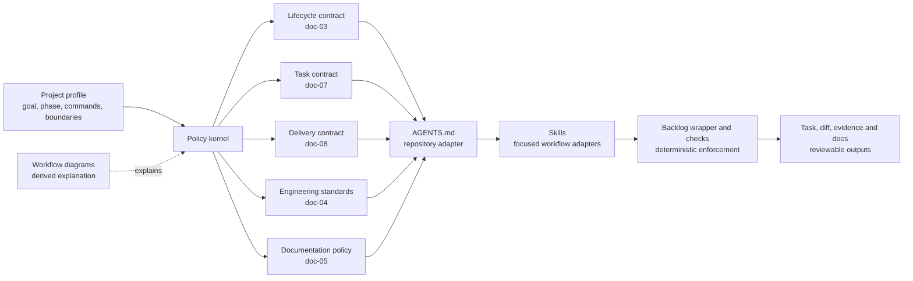

# Architecture and delivery model

Switchflow should behave as a small policy kernel with adapters, not as a collection of overlapping prompts. The current framework is intended to reach the outcomes below, but several rules were repeated across `AGENTS.md`, the Kanban guide, skills, and workflow diagrams. Repetition made a policy change easy to apply incompletely and made review depend on comparing prose copies.

## Preservation boundary

The modular architecture is required to preserve these external results:

- Backlog.md remains the source of truth for active work and durable project knowledge.
- Work still follows **Backlog → Ready → In Progress → Review → Done**, with **Blocked** as a non-terminal execution state.
- Readiness still requires useful progress, observable acceptance, completed dependencies, provisioned evidence and authority, a stable baseline, and a bounded review surface.
- Quality still uses one active target, independent VAPS axes, highest material risk, and explicit authority for protected external actions.
- Workers still stop at Review. Independent reviewers or designated orchestrators accept work. Protected Git and live-system actions still need separate authority.
- Fresh imports remain isolated, token-rendered, and validated before use.

## Target modules

| Module | Owns | Does not own |
| --- | --- | --- |
| Project profile (`doc-02`) | Product goal, descriptive phase, normal gates, protected boundaries. | Generic workflow policy or quality levels. |
| Lifecycle (`doc-03`) | Roles, statuses, exception labels, legal transitions, execution authorization. | Task-writing detail or Git procedure. |
| Task contract (`doc-07`) | Task shape, readiness, evidence classification, dependencies, owner comments, human-task boundaries. | Implementation or acceptance authority. |
| Delivery contract (`doc-08`) | Coordination, isolation, Git procedure, blocker record, handoff, independent review, integration procedure. | Authority grants, product scope, or risk classification. |
| Engineering standards (`doc-04`) | The single active VAPS target, risk classes, safeguards, required evidence. | Task status mechanics or phase selection. |
| Documentation policy (`doc-05`) | Durable-knowledge placement, editing, decisions, and documentation proof. | Live task state. |
| Skills | One role each: trigger-specific sequencing, judgement, and an explicit read limit. | Copies of shared policy, or authority grants. |
| `.switchflow` tooling | Deterministic checks and Backlog CLI adaptation. | Product or architectural judgement. |

## Delivery model

The delivery unit is a task with one useful result and a reviewable stop condition. The framework should keep four passes distinct:

1. **Shape:** create or clarify the task against `doc-07` and the project profile.
2. **Authorize and deliver:** enter execution under `doc-03`, then coordinate and produce evidence under `doc-08` and `doc-04`.
3. **Review:** pin the change surface and independently assess outcome and standards under `doc-08`.
4. **Integrate and learn:** an authorized actor integrates and validates the combined state. If integration materially changes the reviewed surface, independently review the post-integration delta before acceptance. Then update durable knowledge and record blockers or follow-up without silently expanding the accepted task.

Parallel work is an optimization, not a default. Fan out only when assignments have independent outcomes, non-overlapping ownership or stable interfaces, explicit integration order, and reviewable stop conditions. Otherwise sequence the work. The orchestrator owns shared setup, integration, and final validation so workers do not repeatedly rediscover the same baseline problem.

## Dependency direction

Policy dependencies point inward: skills and diagrams depend on governing documents; governing documents do not depend on skill prose. Tooling enforces only facts it can determine reliably. Advisory judgement remains in the policy and skills instead of being disguised as a partial deterministic check.

When a shared rule changes, update its owning document, the smallest affected adapter, and any explanatory diagram. Do not copy the full rule into each consumer.

## Pass one — splitting the policy kernel

The first refactor split the former all-purpose Kanban guide into lifecycle (`doc-03`), task (`doc-07`), and delivery (`doc-08`) contracts, and made engineering standards the sole owner of one quality target, resolving the superseded phase/VAPS split.

| Behavior boundary | Before | Modular owner | Evidence in that pass |
| --- | --- | --- | --- |
| Statuses and legal transitions | Kanban guide | `doc-03` | Semantic comparison of every status and transition; diagram review. |
| Ten-condition readiness gate | Clarification skill plus Kanban prose | `doc-07` | Condition-by-condition comparison and independent review. |
| One active quality target and risk evidence | Contradictory phase/VAPS guidance | `doc-04` | Accepted backlog direction, reference scan, and independent review. An intentional improvement, not strict preservation. |
| Execution obstruction and recovery | Kanban guide | `doc-03` status plus `doc-08` record | Entry timing, required evidence, and return-to-Ready comparison. |
| Independent review and acceptance authority | Kanban guide and `AGENTS.md` | Authority in `doc-03`; procedure in `doc-08` | Authorship and post-integration-delta review traced independently. |
| Protected Git and external actions | Kanban guide, standards, `AGENTS.md` | Grants in `doc-03`; procedure in `doc-08`; safeguards in `doc-04` | Separate-authority clauses retained and reference-scanned. |

## Pass two — roles, artifacts, and measured cost

The second refactor is specified in [Role contracts and the artifact pipeline](role-contracts.md). It replaces ten overlapping skills with six roles, each producing one artifact the next role reads instead of re-deriving from source, and it is the first pass grounded in operating evidence rather than policy comparison alone.

| Change | Rationale | Evidence |
| --- | --- | --- |
| Ten skills become six roles | Three skills existed only to encode authority, requiring "must not invoke" rules | Authority moved to `doc-03` as a recorded grant |
| Each role declares what it must not read | Read limits are what keep intake unbiased and orchestration bounded | Stated per skill and in `docs/skills.md` |
| Orchestration is scoped to one phase and exits | Long sessions re-send accumulated context every turn | p99 session 82.8M tokens; longest 118.8 hours |
| One worker, one task, ended at handoff | Reused workers carry their whole history forward | ~175M excess input across five reused workers |
| Wait once and long; never narrate a timeout | Short polls turn non-events into full-context turns | 353 of 574 waits timed out in one session, ~42.8M tokens |
| Full test suite at the phase gate, not per task | Cross-task interference is only observable after integration | 77 of 223 test runs had no intervening change |
| Diagrams show artifact flow, not decision logic | Every rule existed twice and could be changed in one copy only | `doc-06` reduced from 2,402 to 743 words |

A cost-side baseline now exists: 326 Codex sessions over eight days on one project, recorded in [role contracts §11](role-contracts.md). It shows that orchestrator-first delegation is not itself the expense — the expense is keeping workers, sessions, and approval contexts alive longer than the work requires.

The outcome side remains unmeasured. The disposable import proves structure and rendering, not equivalent agent outcomes over real projects. Claims of better delivery still rest on retained-policy comparison and independent semantic review until a repeatable evaluation exists.

## Deferred changes

- Do not create a custom workflow engine while Backlog.md remains the system of record.
- Do not enforce judgement-heavy readiness or review rules with brittle text checks.
- Do not add automatic upgrade or merge behavior before compatibility requirements are known.
- Do not create a generic skill-composition runtime. Direct references to small policy modules are sufficient.

The next architectural step should be evidence-driven: add deterministic lifecycle enforcement only for a repeatedly observed invalid state, then compare its prevention value with its maintenance cost.
