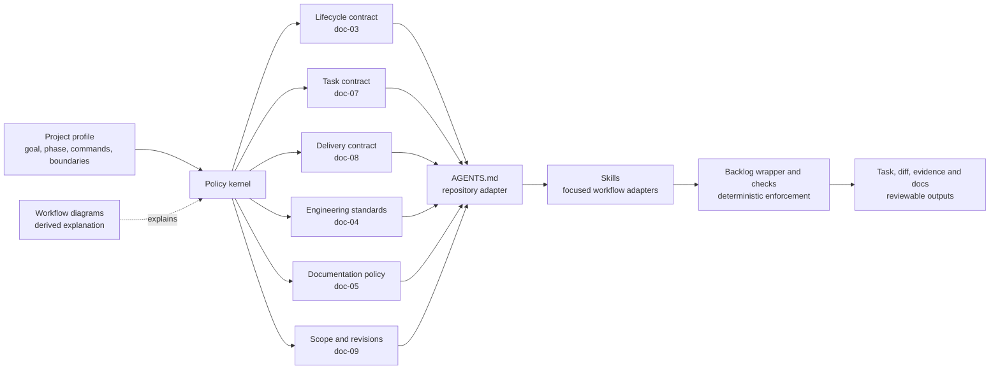

# Architecture and delivery model

Switchflow is a small policy kernel with adapters, not a collection of overlapping prompts. Each rule has one owning document; adapters reference it rather than restating it. Repetition is the failure mode this structure exists to prevent, because a repeated rule can be changed in one copy only, and review then depends on comparing prose.

## Invariants

Any change to the structure must keep these true:

- Backlog.md remains the source of truth for delivery work and durable project knowledge. The external control ledger owns browser approvals, run admission, and recovery; it does not infer completed tasks from process exit.
- Work follows **Backlog → Ready → In Progress → Review → Done**, with **Blocked** for prepared work waiting on a named prerequisite before or after execution.
- Readiness requires useful progress, observable acceptance, completed dependencies, provisioned evidence and authority, a stable baseline, and a bounded review surface.
- Quality uses one active target, independent VAPS axes, highest material risk, and explicit authority for protected external actions.
- Workers stop at Review. Independent reviewers or designated orchestrators accept work. Protected Git and live-system actions need separate authority.
- Fresh imports remain isolated, token-rendered, and validated before use.

## Target modules

| Module | Owns | Does not own |
| --- | --- | --- |
| Project profile (`doc-02`) | Product goal, descriptive phase, normal gates, approval posture, protected boundaries. | Generic workflow policy or quality levels. |
| Lifecycle (`doc-03`) | Roles, statuses, exception labels, legal transitions, execution authorization. | Task-writing detail or Git procedure. |
| Task contract (`doc-07`) | Task shape, readiness, evidence classification, dependencies, owner comments, human-task boundaries. | Implementation or acceptance authority. |
| Delivery contract (`doc-08`) | Coordination, isolation, Git procedure, blocker record, handoff, independent review, integration procedure. | Authority grants, product scope, or risk classification. |
| Engineering standards (`doc-04`) | The single active VAPS target, risk classes, safeguards, required evidence. | Task status mechanics or phase selection. |
| Documentation policy (`doc-05`) | Durable-knowledge placement, editing, decisions, and documentation proof. | Live task state. |
| Scope and revisions (`doc-09`) | Intake checkpoints, accepted scope baselines, shared edit procedure and snapshot recovery. | Delivery authorization or product decisions on the owner's behalf. |
| Skills | One role each: trigger-specific sequencing, judgement, and an explicit read limit. | Copies of shared policy, or authority grants. |
| `.switchflow` tooling | Deterministic checks and Backlog CLI adaptation. | Product or architectural judgement. |
| Browser control (`scripts/control`) | Intake/Planning/UAT transitions, scoped grants, serialized local run admission, owner-input revisions, recovery and localhost API. | Claiming human UAT or interpreting test claims as independently established proof. |
| Managed Git helper (`scripts/control/git-bridge*`) | Fixed local candidate creation, exact-file commits, managed-candidate integration, baseline-bound grants and durable operation receipts. | Primary-checkout mutation, remote Git, deployment, arbitrary commands or silently replaying uncertain operations. |
| UAT text preview (`scripts/control/artifacts.mjs`) | Resolve an exact saved walkthrough reference against the approved candidate registry and read its bounded immutable text blob. | Arbitrary filesystem browsing, working-file substitution, binary rendering or expanding the delivery grant. |
| Operations (`scripts/operations`) | Git-shared state identity, friction, exact check receipts, worktree ownership, scratch promotion and retention. | Automatic out-of-scope work, unknown-worktree deletion, or container/native evidence without execution. |
| Backlog CAS fork | Comparing a task revision under Backlog's existing task lock before applying a partial update. | Product policy or changing the task schema beyond the explicit revision interface. |

The [role contracts](role-contracts.md) specify what each role reads, must not read, produces, and may authorize, along with the operating evidence those limits are derived from.

## Delivery model

The delivery unit is a task with one useful result and a reviewable stop condition. Four passes stay distinct:

1. **Shape:** create or clarify the task against `doc-07` and the project profile.
2. **Authorize and deliver:** enter execution under `doc-03`, then coordinate and produce evidence under `doc-08` and `doc-04`.
3. **Review:** pin the change surface and independently assess outcome and standards under `doc-08`.
4. **Integrate and learn:** an authorized actor integrates and validates the combined state. If integration materially changes the reviewed surface, independently review the post-integration delta before acceptance. Then update durable knowledge and record blockers or follow-up without silently expanding the accepted task.

Dispatch grouping is a planning decision, made where the file-level knowledge lives and recorded in the phase plan for the orchestrator to execute. `doc-08` owns the conditions. The orchestrator owns shared setup, integration, and final validation so workers do not repeatedly rediscover the same baseline problem.

## Dependency direction

Policy dependencies point inward: skills and diagrams depend on governing documents; governing documents do not depend on skill prose. Tooling enforces only facts it can determine reliably. Advisory judgement remains in the policy and skills instead of being disguised as a partial deterministic check.

When a shared rule changes, update its owning document, the smallest affected adapter, and any explanatory diagram. Do not copy the full rule into each consumer.

## What is proved and what is not

A cost-side baseline exists: 326 Codex sessions over eight days on one project, recorded in [role contracts §7](role-contracts.md). It shows that orchestrator-first delegation is not itself the expense. The expense is keeping workers, sessions, and approval contexts alive longer than the work requires, which is what the current lifecycle rules target.

The outcome side is unmeasured. A disposable import proves structure and rendering, not equivalent agent outcomes over real projects. Claims of better delivery rest on retained-policy comparison and independent semantic review until a repeatable evaluation exists.

## Deferred changes

- The browser coordinator is deliberately limited to owner gates and run admission. Backlog continues to own task storage and its canonical edit lock; no second delivery-task database is introduced.
- Do not enforce judgement-heavy readiness or review rules with brittle text checks.
- Do not add automatic upgrade or merge behavior before compatibility requirements are known.
- Do not create a generic skill-composition runtime. Direct references to small policy modules are sufficient.

The next architectural step should be evidence-driven: add deterministic lifecycle enforcement only for a repeatedly observed invalid state, then compare its prevention value with its maintenance cost.
