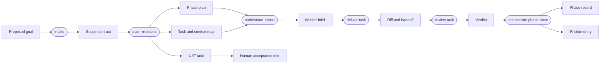
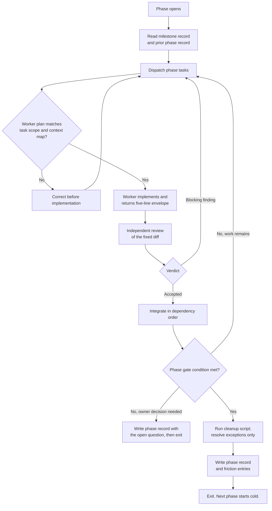

# Role contracts and the artifact pipeline

- **Status:** Proposed. Not yet implemented.
- **Date:** 2026-09-02
- **Supersedes on adoption:** the ten-skill arrangement in [Skills](skills.md) and diagrams 1-7 of `doc-06`.

This document defines what each pillar of Switchflow owns, the artifacts that pass between agent roles, and the contract each role works to. The rest of the redesign is downstream of these boundaries, so this document lands first and the implementation follows it.

## 1. Content placement

Content is placed by lifetime and mutation rate, not by subject.

| Content | Home | Placement test |
| --- | --- | --- |
| True about the product, independent of any task | Backlog documents (`backlog/docs/`) | Would this still be true if the board were empty? |
| True about one unit of work, right now | Board (`backlog/tasks/`, `backlog/milestones/`) | Does it die when the task closes? |
| True about how work moves, across all tasks | One governing document | Is it policy rather than fact? |
| A repeatable multi-step procedure an agent runs | Skill (`.agents/skills/`) | Are the steps both non-obvious and repeated? |
| How the framework itself performed | Friction log (`.switchflow/friction/`) | Is it about the process rather than the product? |
| What every agent needs before it can act safely | `AGENTS.md` | Would an agent be unsafe without it? |

`AGENTS.md` is loaded on every agent invocation and is therefore the most expensive file in the repository per token. Content earns a place in it only by the last test.

The board carries a second responsibility that the current design underuses: it is the durable message bus between agent roles. Any state that must survive a context window belongs on the board rather than in an agent's history.

## 2. The artifact pipeline

Each role reads the artifact produced by the previous role instead of re-deriving it from source. Every artifact is smaller than the context that produced it.



Rounded nodes are roles. Rectangles are artifacts. The chain is acyclic; rework loops live inside a phase, not in the pipeline.

## 3. Work hierarchy

| Level | Boundary condition | Unit of |
| --- | --- | --- |
| **Milestone** | The point at which the owner can use the software and form an opinion. | Human feedback |
| **Phase** | A gate the orchestrator can verify without the owner. | Agent dispatch |
| **Task** | One worker assignment with one useful result. | Delivery |

This replaces the nine splitting criteria currently in `doc-07`. A milestone ends where user acceptance testing is genuinely warranted, so every milestone ends with a Human-assigned UAT task.

Phases exist so orchestration is bounded and resumable. An orchestrator serves one phase, writes a phase record, and exits. The next phase starts with a cold context that reads the record.

### Board representation

| Concept | Representation |
| --- | --- |
| Milestone | Backlog.md milestone record. Carries the scope contract and the UAT definition. |
| Phase | A native parent task created with `--parent`, labelled `phase-N`. Carries the phase plan in its description. |
| Phase record | A comment on the phase parent task. |
| Worker task | A child task carrying a context map, assigned to the milestone and labelled with its phase. |
| Friction entry | `.switchflow/friction/<milestone-id>.md`, append-only, outside the board. |

Verified against Backlog.md 1.50.1:

- `milestone add --description` accepts multi-line Markdown and stores it verbatim under a `## Description` heading. The scope contract fits.
- There is **no `milestone edit` or `milestone update`**. A milestone record is write-once through the CLI. This suits a contract that is frozen at intake, but intake must iterate in conversation and write once at the end. Revision after freezing means `milestone remove` followed by `milestone add`, which also touches task assignments.
- `task create --parent` produces real hierarchical children (`TASK-1` / `TASK-1.1`) with `parent_task_id` in frontmatter. Phase parents are native, not a convention.
- Labels are not restricted to those declared in `backlog.config.yml`. `phase-N` labels work without configuration changes.
- Multi-line description content survives the round trip, so the context map stores cleanly.

Because the milestone record is write-once and the phase parent is editable, the split follows the mutation rate: the frozen contract sits on the milestone, and everything revised during delivery sits on the phase parent.

The phase parent is a tracking artifact. It is never promoted to Ready for worker execution, consistent with the existing coordination-parent rule in `doc-07`.

## 4. Role contracts

Each role declares what it must **not** read. That field is load-bearing: it is what keeps intake unbiased, the orchestrator bounded, and review independent.

### intake

| Field | Value |
| --- | --- |
| Purpose | Convert a proposed goal into a frozen scope contract. |
| Trigger | Owner, explicitly, at the start of a milestone. |
| Reads | The owner. `doc-01`, `doc-02`, product documents. Existing milestone records for overlapping scope. |
| Must not read | Source code, tasks, diffs. |
| Produces | Scope contract, written into the milestone record. |
| Exit condition | The owner freezes the contract. Every material question is answered or explicitly deferred with a recorded default. |
| Model and effort | Frontier, maximum reasoning, deliberately low token budget. |
| Authority | Creates and updates the milestone record. No tasks, no code. |

Intake reads the wiki but not the code by design. An intake agent holding tens of thousands of tokens of implementation detail anchors the owner's answers to what is cheap to build, and starts proposing solutions instead of interrogating intent. The wiki is the correct abstraction level for informed questions.

Intake is the cheapest phase in total tokens and the most expensive per token.

Scope contract shape:

```markdown
## Goal

## In scope

## Out of scope

## Decisions taken

## Alternatives rejected

## Deferred questions and their defaults

## UAT definition
```

The UAT definition states what the owner will do to judge the milestone. It makes the milestone boundary enforceable and tells the planner where to stop.

### plan-milestone

| Field | Value |
| --- | --- |
| Purpose | Turn a frozen scope contract into ordered phases and ready tasks. |
| Trigger | Owner, after freezing the scope contract. |
| Reads | Scope contract, wiki, the repository, existing tasks, the readiness gate in `doc-07`. |
| Must not read | The friction log. |
| Produces | Phase plan in the milestone record; phase coordination parents; worker tasks with context maps; the closing UAT task. |
| Exit condition | Every worker task passes the readiness gate, phases are ordered, each phase has a verifiable gate condition, and the last task is the UAT task. |
| Model and effort | Frontier, maximum effort, high token budget. This is where the repository is read, once. |
| Authority | Board mutations within the named milestone. No code. |

The planner absorbs the readiness gate. There is no separate clarification pass: today `task-creator` creates and `task-clarifier` readies, costing two agents and two repository reads to produce one artifact.

The planner does not re-open questions settled in the scope contract. If the contract proves wrong, the planner stops and returns to intake rather than deciding on the owner's behalf.

Every worker task carries a context map. It is the planner's highest-value output and the reason its repository read is not wasted:

```markdown
## Context map

Advisory. Start here; correct it if it is wrong.

- Change: `src/path/file.ts:120-180`
- Test: `tests/path/file.spec.ts`
- Consumers: `src/other.ts:44`, `src/another.ts:210`
- Pattern to follow: `src/example.ts:60-95`
```

The map is exempt from the task description word limit. It is advisory rather than binding so it never becomes a competing contract.

### orchestrate-phase

| Field | Value |
| --- | --- |
| Purpose | Dispatch, checkpoint, integrate, and close one phase. |
| Trigger | Owner, explicitly, per phase. |
| Reads | Milestone record; the phase coordination parent and its prior phase records; task identifiers, statuses and dependencies for this phase; worker envelopes; review verdicts. |
| Must not read | Diffs, file contents, full task descriptions, worker reasoning. When a diff must be judged, it dispatches a reviewer. |
| Produces | Worker briefs, checkpoint decisions, integration, phase record, friction entries, cleanup trigger. |
| Exit condition | Every phase task is Done or explicitly deferred, the gate condition is verified, cleanup has run and its exceptions are resolved, and the phase record and friction entries are written. |
| Model and effort | Frontier, maximum effort, context bounded by one phase. |
| Authority | Dispatch, integration into the milestone branch, acceptance of independently reviewed work, scripted cleanup. Not product decisions, pushing, history rewriting, or unscripted branch deletion. |

The orchestrator exits at the phase boundary rather than continuing into the next phase. This is the compaction mechanism: durable state moves to the board and the next context starts cold.

Its highest-value action is the pre-implementation checkpoint. A worker returns a three-line plan before implementing; the orchestrator confirms or corrects it. Roughly two hundred tokens prevent a wrong-direction implementation costing tens of thousands.

#### Amending rather than implementing

The orchestrator may amend a task mid-phase when execution evidence shows the plan was wrong. That is the safety net: a frontier model with cross-task visibility correcting a planner miss. It exercises that authority by re-briefing rather than by implementing — amend the task, dispatch a worker.

It may implement directly only within a narrow bound: a single file, no new behaviour, and no new acceptance criterion. Merge conflict resolution and one-line corrections qualify. Anything larger is dispatched, because orchestrator context is the scarce resource the whole design protects.

This replaces the previous prohibition on orchestrators invoking the implementation skill. That rule did not achieve its purpose. It blocked the structured path while leaving the orchestrator free to implement inline, so deviation happened without the delivery contract's discipline. Naming the bound is stricter than banning the skill.

#### Waiting for workers

Wait once, long, and do something else. Never poll.

- Set the wait timeout to the order of magnitude the work actually takes — minutes, not seconds.
- Do independent orchestration work while agents run, or block.
- **Never narrate on a timeout.** A timeout carries no new information, and reporting it costs a full-context turn.
- If a wait must be repeated, back off rather than re-issuing the same short interval.

This is the second-largest measured waste in the current framework. In one milestone-orchestration session, `wait_agent` was called 574 times with `timeout_ms` of 60,000 or less; 353 of those calls (61.5%) timed out. At a mean turn input of 121,294 tokens, that is roughly 42.8M tokens spent establishing that work was not yet finished. Across the corpus, 16 sessions produced 1,114 timed-out waits.

The tool supports what is needed: the same session's waits completed normally 221 times. Event-driven waiting works whenever the wait outlasts the work. The cost comes entirely from choosing a short interval and then reporting the non-event.

#### Reading beyond the envelope

The worker's return value is structurally bounded: whatever the subagent's final message contains is what enters orchestrator context, so a five-line envelope is enforced by the dispatch mechanism rather than by compliance.

What is not structurally enforced is whether the orchestrator then fetches the task detail anyway. That is governed by a trigger rather than a size limit:

> Do not fetch task detail unless the envelope reports a blocking issue, or a review verdict is contested.

On the happy path the orchestrator dispatches the reviewer and never reads the handoff, because the reviewer fetches it. This is the weakest guarantee in the design and the first thing to measure once the loop runs.

Worker return envelope, five lines maximum:

```text
task: PRJ-14
branch: task/PRJ-14
head: <sha>
criteria: 3/3 checked
blocking: none
```

Everything else goes into the task comment, where it is retrievable on demand and does not occupy orchestrator context.

Phase record shape, written to the phase coordination parent:

```markdown
## Phase N closed

- Delivered: PRJ-12, PRJ-13, PRJ-14
- Deferred: PRJ-15 — reason
- Integrated at: <sha> on <branch>
- Gate condition: how it was verified
- Cleanup: n branches removed, n exceptions, listed
- Open for next phase: facts the next orchestrator needs
```

The last line is what makes a cold start possible. If the next orchestrator needs something the record does not carry, the record is wrong.

### deliver-task

| Field | Value |
| --- | --- |
| Purpose | Implement one task. |
| Trigger | Orchestrator brief, or the owner directly. |
| Reads | The task and its context map; the files the map names; `doc-04` at the task's risk class; the delivery loop in `doc-08`. |
| Must not read | Other tasks, the milestone plan, the friction log, policy above its risk class. |
| Produces | A three-line pre-implementation plan, the diff, a handoff comment on the task, and a five-line return envelope. |
| Exit condition | Criteria checked, handoff written, task moved to Review, envelope returned. |
| Model and effort | Selected by risk class. Documentation-only and Standard use a smaller model; Elevated and Critical use a frontier model. |
| Authority | Its own branch or worktree and scoped commits. Never `main`, never another task. |

Policy loading is proportional to risk. A Documentation-only or Standard task reads the task, its context map, and the delivery loop. Elevated and Critical additionally read `doc-03`, the full `doc-07`, and the relevant boundaries in `doc-04`. Under the current design a typo fix pays the same policy tax as a schema migration.

The risk class is already computed for verification purposes. Using it to select the worker model is free.

#### One worker, one task, then end it

A worker ends at its handoff. The next logical task gets a new worker, even when the finished worker already holds relevant context.

This is not a preference. It is the largest measured waste in the current framework: five reused workers carried an estimated 175M excess input tokens after their first completed handoff, across 43 follow-up assignments and 20 compactions. One session opened as a reconciliation audit, finished it at line 111, then absorbed two reviews and five separate implementations across 692 turns.

Reuse is tempting because the context is already loaded and loading it again looks wasteful. The accounting runs the other way. Accumulated context is re-sent on every subsequent turn, so a worker's cost grows with the square of its lifetime, while a fresh worker's startup read is paid once. Cheap context is context you do not send again.

Corrections after review are part of the same task and stay with the same worker. A different task is a different worker.

### review-task

| Field | Value |
| --- | --- |
| Purpose | Produce an independent verdict on a fixed diff. |
| Trigger | Orchestrator, after a worker returns. |
| Reads | The task and its criteria; the fixed base, HEAD and diff; affected contracts; the risk class in `doc-04`. |
| Must not read | The worker's reasoning beyond the factual handoff. |
| Produces | A verdict, a five-line envelope to the orchestrator, and full findings as a task comment. |
| Exit condition | Verdict recorded. |
| Model and effort | At least as capable as the worker that produced the change. |
| Authority | Read-only unless status or acceptance authority is separately granted. |

The reviewer judges the artifact, not the argument. Reading the worker's rationale converts independent review into agreement.

Reviewing is harder than writing, so the reviewer is never the weaker model.

Blast-radius analysis becomes an escalation section within this role rather than a separate skill. It triggers on a suspicious small diff or a durable Elevated or Critical boundary: name one or two decisive safety facts, trace downstream consumers, and prove each fact with the cheapest credible evidence.

The escalation is gated by a declaration. Every verdict states which trigger fired, or states that none did:

```text
blast-radius: none — no durable boundary, diff proportionate to task
blast-radius: Elevated — persisted shape changed at src/store/schema.ts:88
```

Requiring the declaration is what makes the gate real. A trigger phrased only as permission ("use it for X") reads as an invitation and gets run on every task, which buys correlated findings from the same model at double the cost rather than independent coverage.

### create-human-task

| Field | Value |
| --- | --- |
| Purpose | Define work only a person can do. |
| Trigger | Any role reaching a human-only dependency; the planner always, at milestone end. |
| Reads | The human-task section of `doc-07`; the UAT definition in the scope contract. |
| Must not read | Source code. |
| Produces | A `Human`-assigned task with numbered steps and report-back evidence. |
| Exit condition | Task created, linked as a dependency, board check passes. |
| Model and effort | Small. This is templating. |
| Authority | Creates one task. |

This role becomes load-bearing rather than occasional, because every milestone closes with a UAT task. That is what delivers the goal of delineating human-only work in advance instead of halting mid-orchestration.

## 5. The phase loop



The loop has two exits and no wait states. When the orchestrator needs the owner, it records the question and exits rather than holding context open.

### Where verification runs

Verification evidence splits by level, and `doc-04` currently does not make the split. Its Standard row reads "changed-outcome tests plus the repository's normal gate", and "normal gate" is being read as the full suite, so the full suite runs once per task instead of once per phase.

| Level | Evidence | Runs |
| --- | --- | --- |
| Task | Changed-outcome tests only, selected by the context map. | Once per delivery attempt. |
| Phase gate | The full repository suite, on the integrated branch. | Once per phase. |

The full suite protects against cross-task interference: worker A breaking worker B's code. That failure only becomes observable after integration, so a full-suite run on an isolated task branch cannot detect the thing it is being run for. Moving it to the phase gate is both cheaper and more correct.

The cost of over-running is not only tokens. Suite output — especially failure output — occupies the worker's context and displaces the code it needs to reason about. That displacement is the larger hidden cost and it does not appear on any invoice.

`doc-04`'s risk table needs a second evidence column when this lands, so task-level and phase-level requirements stop sharing one ambiguous cell.

## 6. Cleanup

Cleanup splits by whether judgement is required.

**Deterministic cleanup is a script**, run at the phase boundary. Its predicate: for each task in this phase whose status is Done, whose branch is merged into the integration branch, and which has no unmerged commits, delete the branch and remove the worktree. No reasoning, no orchestrator tokens.

**Exceptions belong to the orchestrator.** An unmerged branch on a Done task, a worktree with uncommitted changes, or a branch whose task was archived each need a decision. These are few.

This is a safety improvement rather than a relaxation. The current blanket rule requiring explicit authority for any branch deletion is too broad to grant as a standing permission, so cleanup never runs and residue accumulates. A narrow standing grant covering exactly the predicate above is both safer and effective, and general branch deletion remains separately authorized.

## 7. The friction log

Findings divide by lifetime.

**Task-level findings** — bad scope, a wrong dependency, an inaccurate context map — belong on the task. The blocker record in `doc-08` already asks whether readiness could have detected the obstruction; that field stays and is used.

**Framework-level findings** — the readiness gate misses a class of problem, workers keep rediscovering the same setup, a policy is ambiguous — have no home today. They are not product knowledge and they outlive their task.

They go in `.switchflow/friction/<milestone-id>.md`, append-only:

```markdown
### 2026-09-02 phase 2

- Cost: what consumed time or tokens
- Estimate: tokens or wall time, roughly
- Preventable: which policy could have caught it, or none
- Proposed change: one sentence
```

The orchestrator writes entries at the phase boundary, in the same action that writes the phase record. It is the only role that sees across tasks, so it is the correct author, and the marginal cost is near zero.

No delivery role reads the friction log, so it costs nothing in the hot path. The owner reads it, and it periodically becomes a Switchflow change. Together with per-task metrics it is the evidence loop that `SF-01` and `SF-02` defer.

### Per-task metrics

Record six values in implementation notes on completion: total tokens, wall time, owner interventions, returned-from-review, scope changed, risk class. After roughly twenty tasks, the question of whether the governance overhead pays for itself has an answer rather than an intuition.

## 8. Mapping from the current skills

| Current skill | Disposition |
| --- | --- |
| `task-creator` | Merged into `plan-milestone`. |
| `task-clarifier` | Merged into `plan-milestone`; the readiness gate becomes its exit condition. |
| `milestone-review` | Merged into `plan-milestone`. |
| `task-implementer` | Becomes `deliver-task`, usable by both the owner and the orchestrator. |
| `milestone-orchestrator` | Becomes `orchestrate-phase`, scoped to one phase. |
| `task-reviewer` | Becomes `review-task`. |
| `blast-radius-review` | Becomes an escalation section inside `review-task`. |
| `quality-profile` | Removed. Its content already lives in `doc-04`. |
| `stakeholder-questionnaire` | Removed as a skill; becomes a template in the task contract. |
| `create-human-task` | Retained, promoted to a required step at milestone close. |
| — | `intake` added. |

Three rules disappear with this mapping: the two explicit-invocation-only policies and the prohibition on orchestrators invoking `task-implementer`. Those exist only because skills are currently doing duty as an authority mechanism. Authority belongs in `doc-03` as a grant recorded against the work, not in skill invocation policy.

## 9. Governing test

The framework can become the project. Six roles, six artifacts, and a learning log are already close to the limit of what is worth carrying.

**If an artifact is written but never read by the next role, delete it.**

Apply this to the scope contract, the context map, the phase record, and the friction log after several milestones. Anything failing the test is removed rather than improved.

## 10. Open questions

### Resolved

1. **Milestone record bodies.** Confirmed working. `milestone add --description` stores multi-line Markdown verbatim. The blocker in practice is that a literal `\n` is stored as text, so the description must carry real newlines — a single-quoted PowerShell here-string, matching the pattern `doc-07` already documents for comments. The remaining constraint is that milestones are write-once through the CLI, which suits a frozen contract. No fork is required.
2. **Phase labels.** Confirmed working. Labels are not validated against `backlog.config.yml`, and `task create --parent` provides native hierarchical children, so phase parents need no convention. Adding `phase-N` to the config list remains worthwhile for board display, not for correctness.

### Open

3. **Model selection.** Whether the Codex subagent interface lets the orchestrator select a model per worker determines whether risk-based model selection is automatic or a documented owner action.
4. **Standing cleanup authority.** The narrow deletion predicate needs the owner's explicit standing grant recorded in `doc-03` before the script may run unattended.
5. **Envelope discipline.** The return size is structurally enforced by dispatch. Whether the orchestrator honours the no-further-fetch trigger is behavioural and unmeasured. This is the design's weakest guarantee.
6. **Outcome-side baseline.** Section 11 establishes the cost-side baseline. The outcome side — task scoping quality, review catch rate, how often tasks bounced from Review — is still unmeasured, and would come from a board-and-git review of the same project.

## 11. Baseline measurement

Taken from 326 Codex session logs for one project running the current framework, 2026-08-26 to 2026-09-02. Cumulative input includes cached tokens, which bill at a discount, so these are volume figures rather than spend.

| Measure | Value |
| --- | --- |
| Sessions | 326 |
| Cumulative tokens | 1,717,974,119 |
| Cached share of input | 96.8% |
| Output share of total | 0.3% |
| Median session | 1,069,491 |
| p99 session | 82,825,074 |
| Longest session | 118.8 hours |

Waste by cause. These overlap and must not be summed.

| Cause | Volume | Nature |
| --- | --- | --- |
| Approval transcript replay | ~401M | Client configuration |
| Reusing finished workers | ~175M | Lifecycle rule |
| Short-timeout polling | ~113M | Tool parameter |
| Re-reads with no intervening change | ~28M | Missing context map |
| Test runs with no intervening change | ~9M | `doc-04` ambiguity |

Two conclusions follow.

**Orchestrator-first delegation is not the cost.** No entry above is caused by having an orchestrator. Orchestration sessions are large because the orchestrator keeps workers alive that should end and polls waits that should block — both instructions, not architecture. The design in this document addresses the second, third, fourth and fifth entries directly.

**The largest cost is outside the framework entirely.** Sixty-six sessions made zero tool calls across 3,798 turns and consumed 401M tokens — 23.4% of all volume — deciding whether to permit actions. That is roughly 105,000 tokens per approval decision, because each decision replays the accumulated transcript. No framework change reaches this. It is a client setting, and it is worth more than every change in this document combined.

Because it is the dominant cost and nothing currently governs it, **approval posture becomes a project-profile concern.** `doc-02` should record which command families are pre-approved, what escalates, and at what granularity approvals run — alongside the verification commands and protected boundaries it already owns.

The unifying pattern behind the first three entries: things are kept alive because ending them feels wasteful. Workers, sessions, approval contexts. Under per-turn cumulative billing, longevity is the expense and early termination is the optimisation. Every phase-exit, worker-lifecycle, and wait rule in this document is one application of that.
