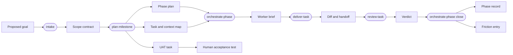
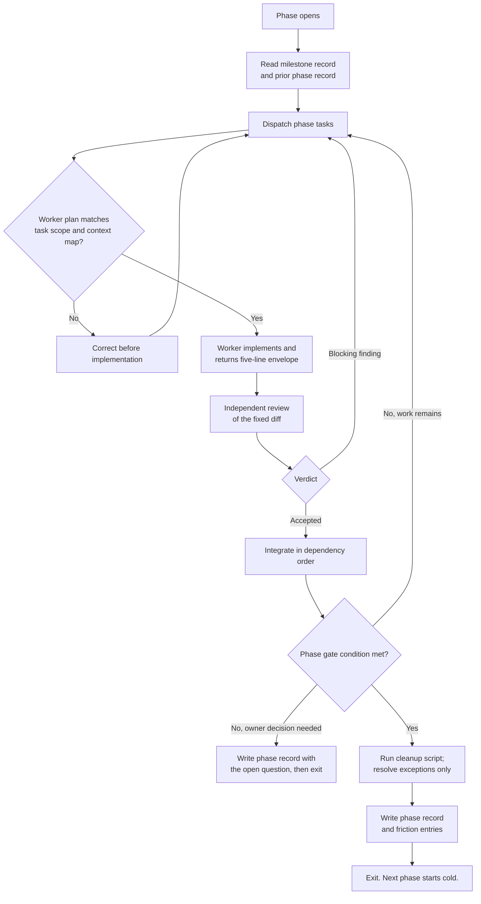
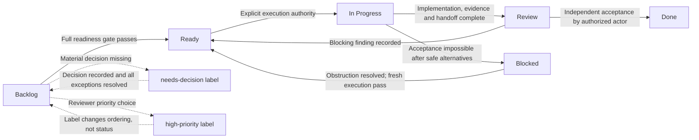

# Workflow diagrams

These diagrams show how work moves and what each role hands to the next. They are a map, not a rulebook.

Decision rules are owned by prose, not by these pictures. When a diagram and a governing document disagree, the document is correct. Conditions, thresholds, and exceptions live in the [Kanban workflow](/documentation/03/kanban-workflow), the [task contract](/documentation/07/task-contract), the [delivery contract](/documentation/08/delivery-contract), and [engineering standards](/documentation/04/engineering-standards).

Drawing decision logic here previously duplicated every rule in two places and made a policy change easy to apply to one copy only. These diagrams therefore show artifact flow and status, which a picture conveys better than prose, and leave conditional logic where it can be maintained.

## 1. Artifact pipeline

Each role reads the artifact the previous role produced instead of re-deriving it from source. Every artifact is smaller than the context that produced it.

Rounded nodes are roles. Rectangles are artifacts. The chain is acyclic because rework loops belong inside a phase rather than in the pipeline.

Three levels bound the work. A **milestone** ends where {{OWNER_NAME}} can use the software and form an opinion, so it closes with a Human-assigned acceptance test. A **phase** ends at a gate the orchestrator verifies alone. A **task** is one worker assignment with one useful result.

## 2. Phase loop

An orchestrator serves one phase, records what the next one needs, and exits. Durable state moves to the board so the next phase starts with a cold context.

The loop has two exits and no waiting states. When the orchestrator needs a decision from {{OWNER_NAME}}, it records the question and exits rather than holding a context open.

The checkpoint before implementation is the orchestrator's highest-value action. A worker states its intended approach in three lines and the orchestrator confirms or corrects it, which costs far less than discovering a wrong direction after the work is done.

## 3. Status lifecycle

**Blocked** is an execution state entered only after work has started. `needs-decision` is a clarification exception used during Backlog refinement and never a substitute for Blocked. `high-priority` changes ordering, not status.

Readiness does not authorize implementation. The [Kanban workflow](/documentation/03/kanban-workflow) owns which actor may make each transition.

## Where the rules live

| Question | Answer |
| --- | --- |
| When is a task Ready? | [Task contract](/documentation/07/task-contract), readiness gate |
| Who may change status or accept work? | [Kanban workflow](/documentation/03/kanban-workflow), ownership and authority |
| How is work coordinated, reviewed and integrated? | [Delivery contract](/documentation/08/delivery-contract) |
| How much verification does this change need? | [Engineering standards](/documentation/04/engineering-standards), risk and verification |
| Does this change durable documentation? | [Maintaining documentation](/documentation/05/maintaining-documentation) |
| What is in and out of scope for this milestone? | The milestone's scope contract |
